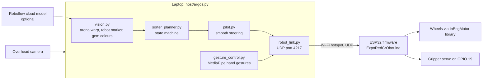
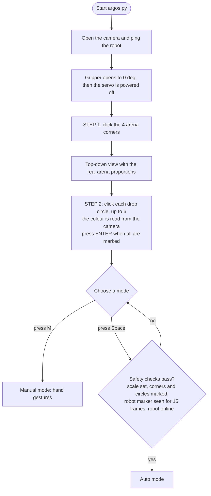
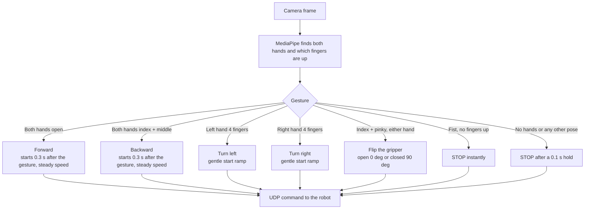
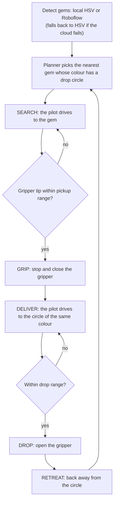
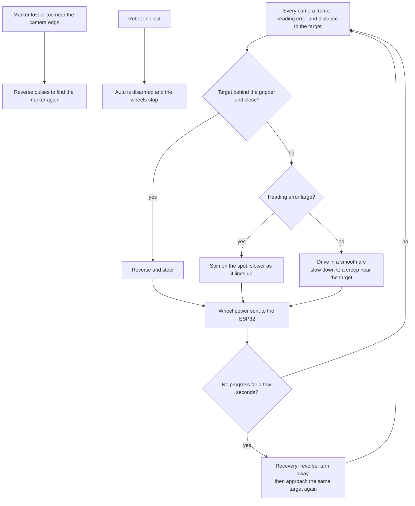
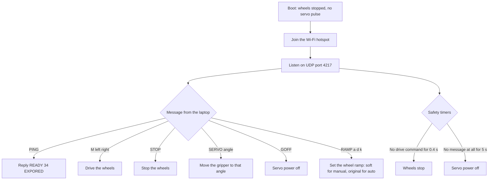
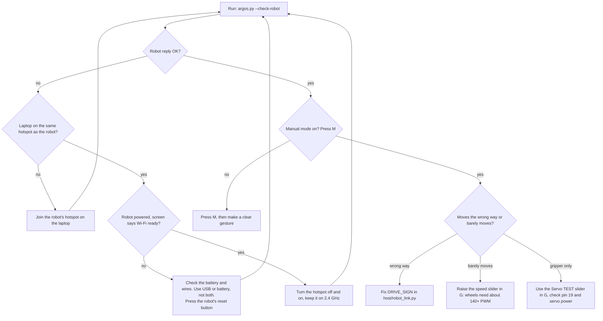

# ARGOS (Autonomous Robotic Gemstone Overhead Sorter) 🏆

Overhead-camera tracking system (Python, runs on the laptop) and ESP32 firmware for the gemstone color-sorting robot.

Main program: **`host/argos.py`** — sorts gems into the drop circles you mark (**up to 6 circles**; the color of each circle you click decides which gems go there).

---

## 🗺️ System Flowcharts

### 1. How the parts connect



### 2. Start-up and setup



### 3. Manual mode (hand gestures)



### 4. Auto mode: one sorting cycle



### 5. Auto mode: how the pilot steers and recovers



### 6. What the robot (ESP32) does with each message



### 7. Troubleshooting: the robot does not move



---

## 📁 Project Layout

```
platformio.ini          ESP32 build config (points at firmware/src)
firmware/src/           ESP32 firmware: ExpoRedCrObot.ino (motors via lib/InEngMotor)
  secrets.example.h     copy to secrets.h and fill in the Wi-Fi name/password
host/                   Python code that runs on the laptop
  argos.py              main program: camera, setup clicks, manual + auto modes
  robot_settings.json   robot size, gripper length/size, scale, speeds (edit or press G)
  setup_panel.py        the G slider panel
  vision.py             arena warp, robot marker, HSV + Roboflow gem detection
  sorter_planner.py     auto state machine: search → grip → deliver → drop
  pilot.py              smooth continuous steering (spin / arc / reverse, creeps up to targets)
  robot_link.py         UDP link to the ESP32 (port 4217)
  gesture_control.py    MediaPipe hand gestures for manual mode
  camera_stream.py, navigation_math.py, safety.py
  assets/               robot marker image + MediaPipe hand model
tools/
  check_colors.py       test gem color detection on saved photos (no robot)
  sim_pilot.py, sim_cycle.py   offline simulations of the auto driving and full sort cycles
  smoke_auto.py, smoke_manual.py   run the real program loop on a photo with a fake robot (auto drive / manual gestures and keys)
  test_roboflow.py      test the Roboflow cloud model on a dataset photo
data/
  dataset/raw_images/   arena photos used to train the Roboflow model
  captures/             frames auto-saved during Auto runs (not in git)
```

---

## 🚀 How to Run

```bash
.venv/bin/python -m pip install -r host/requirements.txt
.venv/bin/python host/argos.py --mm-per-pixel <measured value>
```

Useful options:

| Option | Meaning |
|---|---|
| `--sites 6` | Most drop circles you can mark, 1-6 (default 6). Press `ENTER` during setup to finish with fewer |
| `--no-gripper` | Test driving without the servo: no servo commands, each gem is visited once |
| `--colors crimson,violet` | Only look for these gem colors (default: all six) |
| `--gripper-distance-px 110` | Gripper center ahead of the marker (default 110) |
| `--detector roboflow` | Use the Roboflow cloud model (needs `ROBOFLOW_API_KEY`) instead of local HSV |
| `--robot-ip 10.99.204.31` | Robot IP if the hotspot blocks broadcast discovery |
| `--scan-cameras` / `--check-robot` | Check the camera or the robot link without moving |

### Setup Steps
1. **STEP 1:** Click the 4 arena corners.
2. **STEP 2:** Click the center of each drop circle (up to 6, one per colour). The color is read from the camera. If you have fewer than 6, press `ENTER` when they are all marked; the choice is remembered.
3. **READY:** Press `Spacebar` for Auto Mode, or `M` for gesture control.

### Manual mode gestures

Press **`M`**. The camera must see your hands.

| Gesture | Robot does |
|---|---|
| Both hands open (5 + 5) | Forward (starts 0.3 s after the gesture) |
| Both hands: index + middle fingers up, ring + pinky folded (thumb in or out) | Backward (starts 0.3 s after the gesture) |
| Left hand: 4 fingers (no thumb) | Turn left (gentle start ramp) |
| Right hand: 4 fingers (no thumb) | Turn right (gentle start ramp) |
| Index + pinky up, either hand | Flip the gripper between open (0°) and closed (90°) |
| Closed fist, no fingers up | Stop immediately |
| No hands | Stop after 0.1 s |

After one gesture ends, the next gesture is ignored for 0.3 s. Speeds, the delays and the turn ramp are sliders in the **`G`** panel (*Manual speed*, *Backward speed*, *Manual turn speed*, *Fwd/back delay*, *Turn accel*).

**What the camera sees:** a yellow line at the bottom of the window shows how many hands it found, their size, which fingers are up on each hand (T I M R P = thumb index middle ring pinky) and the command it chose, for example `L:I R:I -> B`. Use it to check a gesture.

**Small hands are ignored:** hands smaller than *Min hand size* (default 12% of the picture height) are skipped, so people or hands in the background cannot drive the robot. Hold your hands closer to the camera, or lower the slider, if your own hands are ignored.

**Keyboard backup while Manual is on:** `W` forward, `S` backward, `A` left, `D` right (keep the key pressed), `X` stop, `O` open gripper, `C` close gripper. Gestures take priority, and a closed fist still stops the robot.

### Robot setup panel (gripper + robot size)

After the arena corners are set, press **`G`**. A slider window opens:

| Slider | What it is |
|---|---|
| Gripper length px | distance from the roof marker to the gripper center (green cross) |
| Gripper size px | radius of the green pickup circle — stone inside = close gripper |
| Robot size px | orange circle around the robot; colors inside are ignored |
| Robot rear px | how far the robot body reaches behind the marker |
| mm per px x100 | arena scale × 100 (arena width in mm ÷ 800). 0 = Auto blocked |
| Arena width / height mm | real size of the field. Set both and restart: the top-down view then has the true proportions (better steering) and the scale is set for you |
| Auto min / max / spin power | wheel power for the auto pilot (min = slowest that still moves the rover) |
| Drop distance mm | how close to the drop circle before opening |
| Min hand size | smallest hand (% of picture height) that counts as a gesture; smaller hands are ignored |
| Manual speed / Backward speed / Manual turn speed | PWM for forward / backward / turning in manual mode |
| Gesture pause | seconds after one gesture ends before the next gesture is accepted (default 0.3; a fist still stops instantly) |
| Fwd/back delay | seconds to wait after the gesture before forward/backward starts (0 = instant) |
| Turn accel +- PWM / Turn accel sec | how gently a turn ramps up when it starts |
| Servo OPEN / CLOSE angle | gripper angles (default 0° open, 90° closed) |
| Servo TEST angle | drag to move the gripper live and find the right angles |
| Cruise / Creep speed | PWM for normal driving / slow final approach |

Changes apply live and save to `host/robot_settings.json` automatically. Command-line flags still override the file for that run.

### Auto mode (test without the servo)

```bash
.venv/bin/python host/argos.py --no-gripper
```

1. Click the 4 arena corners, then each drop circle (up to 6). Press `ENTER` if you have fewer than 6.
2. Press **`G`** and set **Arena width / height mm** (then restart) or **mm per px**; auto stays blocked until a scale is set.
3. Place the robot, wait for the green marker arrow, press **`Space`**.

The robot steers continuously (no stop-and-go): it spins to face the gem, drives in a smooth arc, slows to a creep and stops on it, then goes to the circle with the gem's color. Drive power is the *Auto min / max / spin power* sliders. Gem detection is local HSV; for Roboflow add `--detector roboflow` and set `ROBOFLOW_API_KEY` (workflow `arena-gemstone-rover-detections-1790759099763`).

### Auto mode pseudocode: the robot creates a line and follows it

```text
every camera frame while Auto is ON:
    view  = warp the camera image to a top-down map of the arena
    pose  = find the robot marker  (x, y, heading)
    gems  = detect gems (local HSV or Roboflow)
    gems  = keep only gems whose colour has a drop circle

    choose the target for the current phase:
        SEARCH   -> the chosen gem (keep the same gem until it is picked)
        DELIVER  -> the drop circle that has the same colour as the carried gem
        HOME     -> the saved home point

    path = straight LINE from the gripper to the target    # created again every frame,
                                                          # drawn as a yellow line on screen
    error    = angle between the robot's heading and the path direction
    distance = distance from the gripper tip to the target

    if distance <= stop range:
        next phase:  SEARCH -> GRIP (close) -> DELIVER -> DROP (open) -> RETREAT -> SEARCH
    else:
        go along the path:
            target is behind the gripper and close  -> reverse
            error is large                          -> spin on the spot until facing the path
            otherwise                               -> drive along the path in a smooth arc,
                                                       steer to keep the error at 0,
                                                       slow to a creep near the target

    if there has been no progress for a few seconds:
        reverse, turn away, then create a new path from the new position
```

The path is a straight line that is rebuilt from the robot's current position every frame (you can see it as the yellow line), so if the robot is pushed off the line, or a gem moves, the next path starts from where it is now. It does not plan routes around obstacles.

### Test colors without the robot

```bash
.venv/bin/python tools/check_colors.py data/captures/raw/*.jpg
```

Writes annotated images to `data/color_check/`.

### Firmware

Copy `firmware/src/secrets.example.h` to `firmware/src/secrets.h`, fill in the Wi-Fi details, then build and upload with PlatformIO from the project root (the upload port is fixed to `/dev/cu.usbserial-1120` in `platformio.ini`):

```bash
pio run -t upload
```

The robot only needs a re-upload when `firmware/src/ExpoRedCrObot.ino` changes. Changes to the speed, delay or gripper angle settings are laptop-side only.

The robot accepts these UDP messages on port 4217:

| Message | Meaning |
|---|---|
| `PING` | reply `READY 34 EXPORED` |
| `M left right` | drive the wheels (-255 to 255 each) |
| `STOP` | stop the wheels |
| `SERVO angle` | move the gripper servo (0-180°) |
| `GOFF` | turn the gripper servo power off |
| `RAMP accel decel kick` | set the wheel ramp (soft for manual, original for auto) |

---

## ⌨️ Hotkeys
- `Spacebar` : Start / Stop Auto Mode
- `Enter` : During setup, finish with the drop circles marked so far (fewer than 6)
- `[` / `]` : Adjust brightness (clears drop-circle marks)
- `Z` : Re-mark drop circles · `R` : Reset corners and circles
- `H` : Save home position · `B` : Return home and restart
- `G` : Robot setup panel (gripper length/size, robot size, scale, speeds)
- `M` : Toggle Manual Mode (hand gesture control)
- `Q` : Quit
