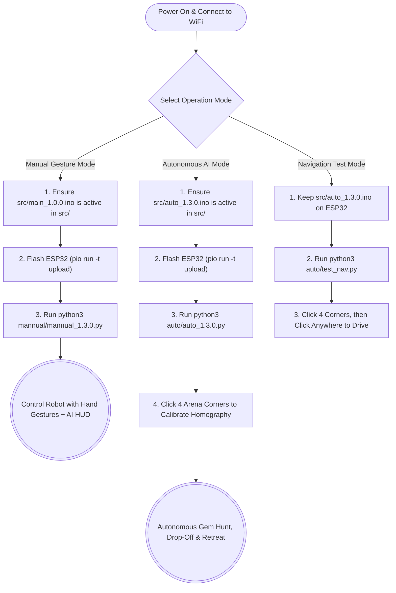

# Dual-Camera Autonomous & Manual Pick-and-Place Robot (v1.3.0)

A dual-mode robotic vehicle developed for the Mineral Yard engineering demonstration. This system features a hybrid architecture allowing for both **manual gesture control with live AI vision overlay** and **full AI automation** using overhead ArUco tracking (ID 34) and Roboflow Cloud Inference (`arena-gem-and-drop-zone-detectio`).

All communications are streamed via bidirectional zero-lag UDP between the Host PC and an ESP32 microcontroller controlling a dual H-bridge motor driver (`InEngMotor`) and twin servo grippers.

---

## 🚀 What We Have Accomplished So Far (Changelog & Architecture)

### 1. Autonomous Pick-and-Place & Retreat Pipeline (`v1.3.0`)

- **Multi-Stage Bidirectional State Machine:**
  1. `SEEKING_GEM`: Prioritizes and locks onto the closest detected Gem from the Roboflow workflow. Draws a red aiming vector.
  2. `GRABBING_GEM`: Triggers at $< 15\text{ cm}$ (`150 mm`), halts the rover, closes the servo gripper (`180°`) with active LEDC PWM holding power, and waits for the `GRABBED` UDP confirmation packet from the ESP32.
  3. `SEEKING_DROP`: Automatically switches target priority to the Drop Zone (`HAS_GEM = True`). Draws a thick cyan return trajectory vector on the HUD.
  4. `DROPPING_PAYLOAD` (**Drop-off & Retreat Sequence**): Triggers at $< 15\text{ cm}$ from the Drop Zone via the `RELEASE_PAYLOAD` UDP command:
     - **Step 1 (Release):** Opens servos (`0°`) and holds for `300 ms`.
     - **Step 2 (Retreat):** Reverses straight back (`-50%` PWM) for `800 ms` so the chassis clears the dropped gem without dragging it.
     - **Step 3 (Reset):** Halts motors, sends `DROPPED` UDP confirmation back to the Host PC, and loops back to `SEEKING_GEM` for the next gem.

### 2. Navigation, Kinematics & Hardware Fixes

- **ArUco Marker Orientation Update:** Switched robot tracking marker from ID `30` to **ID `34`** (`ROBOT_ARUCO_ID = 34`) to match physical mounting orientation.
- **Constant-Speed Pivot-then-Drive Steering:** Replaced oscillating proportional math with deterministic constant-speed states:
  - **Pivot in Place:** When angular error $> 0.35\text{ rad}$ ($\sim 20^\circ$), the robot pivots on the spot before driving forward.
  - **Straight Drive:** Once aligned, the robot drives straight toward the target.
- **Stall-Torque Hardware Protection (`clamp_speed`):** Decoupled logical speed requests from physical DC motor deadbands by enforcing a minimum active PWM clamp (`110–255`), preventing motor humming/stalling during low-power turns.
- **Fast Anti-Slip Software LERP (`60 ms` ramp):** Implemented a `15 PWM / 10 ms` acceleration step in `src/auto_1.3.0.ino` to prevent wheel slip (which blurs the ArUco marker) without introducing input lag.
- **Coasting During Cloud Inference:** Maintained the last valid steering command while waiting for the asynchronous `200–400 ms` Roboflow API response, eliminating stop-and-go stuttering.
- **ESP32 UDP Queue Drain & Scoping Fix:** Drains old buffered UDP packets in the loop so the rover always acts on the newest frame data.

### 3. Manual Mode & Debugging Tools

- **Manual Gesture Control + AI Vision Overlay (`mannual/mannual_1.3.0.py`):** Added a background Roboflow thread to manual gesture mode so operators can see live bounding boxes for Gems and Drop Zones while driving with hand gestures (including 4-finger Left/Right turns and zeroed initial servo angles).
- **Click-to-Drive Navigation Tester (`auto/test_nav.py`):** Created a standalone ArUco navigation test tool that removes Roboflow overhead and lets you click anywhere on the warped arena view to test physical turning and straight-line driving in isolation.
- **Engineering Post-Mortem (`lessons_learned.md`):** Documented hardware deadband/stall-torque lessons and UDP latency pitfalls.

---

## 🗺️ System Flowchart (How to Use)



---

## 📁 File Structure & Purpose

> [!IMPORTANT]
> Because PlatformIO compiles all `.ino` files found in the `src/` folder simultaneously, **ensure only one `.ino` file is active in `src/` at a time**. Move unused firmwares to `src/backups/` or rename them with `.bak`.

### Autonomous Scripts (`auto/`)

- **[auto/auto_1.3.0.py](file:///Users/prem/Documents/Eng-Expo/Eng-Expo-1/auto/auto_1.3.0.py)**: **Primary Autonomous Brain (Latest)**. Full state machine (`SEEKING_GEM` $\rightarrow$ `GRABBING_GEM` $\rightarrow$ `SEEKING_DROP` $\rightarrow$ `DROPPING_PAYLOAD`), ArUco ID `34` tracking, constant-speed pivot/drive steering with stall-torque clamping, and bidirectional UDP feedback.
- **[auto/test_nav.py](file:///Users/prem/Documents/Eng-Expo/Eng-Expo-1/auto/test_nav.py)**: **Click-to-Drive Diagnostic Tool**. Tests ArUco ID `34` tracking and motor steering by clicking target coordinates directly on the warped map.
- **[auto/auto_1.2.0.py](file:///Users/prem/Documents/Eng-Expo/Eng-Expo-1/auto/auto_1.2.0.py)**: Previous iteration of the autonomous state machine.

### Manual Scripts (`mannual/`)

- **[mannual/mannual_1.3.0.py](file:///Users/prem/Documents/Eng-Expo/Eng-Expo-1/mannual/mannual_1.3.0.py)**: **Primary Manual Brain (Latest)**. MediaPipe hand-gesture controller with 4-finger left/right turning, movement delays, initial `0°` servo reset, and live Roboflow AI detection overlay.

### ESP32 Firmware (`src/`)

- **[src/auto_1.3.0.ino](file:///Users/prem/Documents/Eng-Expo/Eng-Expo-1/src/auto_1.3.0.ino)**: **Active Autonomous Rover Firmware (Latest)**. Features 60ms fast LERP anti-slip motor control, active LEDC servo holding, autonomous `RELEASE_PAYLOAD` 800ms reverse retreat sequence, and `GRABBED`/`DROPPED` UDP telemetry replies.
- **`src/backups/`**: Contains archived firmwares (`auto_1.1.0.ino.bak`, `main_1.0.0.ino.bak`, etc.).

### Documentation & Utilities (`/`)

- **[lessons_learned.md](file:///Users/prem/Documents/Eng-Expo/Eng-Expo-1/lessons_learned.md)**: Post-mortem analysis on DC motor stall torque (deadband), PWM clamping, and LERP latency tuning.
- **`capture_dataset.py`**: Rapid camera dataset collection utility for training Roboflow models.
- **`platformio.ini`**: PlatformIO ESP32 configuration and library dependencies (`TFT_eSPI`, `InEngMotor`).

---

## 🔌 Hardware Pinout & Specifications

| Component         | ESP32 Pin  | Peripheral / Library  | Function                          |
| :---------------- | :--------- | :-------------------- | :-------------------------------- |
| **Left Motor**    | `26`, `27` | `InEngMotor` (Ch 0-1) | Forward / Reverse PWM             |
| **Right Motor**   | `17`, `16` | `InEngMotor` (Ch 2-3) | Forward / Reverse PWM             |
| **Gripper Servo** | `19`       | Native `ledc` (Ch 4)  | Gripper (`0°` Open, `180°` Close) |
| **Display**       | SPI Bus    | `TFT_eSPI`            | IP & Telemetry HUD                |

---

## 💻 Quick Start Commands

### 1. Flash ESP32 Firmware

```bash
pio run -e esp32dev -t upload
```

### 2. Run Autonomous Mode (v1.3.0)

```bash
source .venv/bin/activate
python3 auto/auto_1.3.0.py
```

### 3. Run Click-to-Drive ArUco Test

```bash
source .venv/bin/activate
python3 auto/test_nav.py
```

### 4. Run Manual Gesture Mode with AI Overlay

```bash
source .venv/bin/activate
python3 mannual/mannual_1.3.0.py
```
