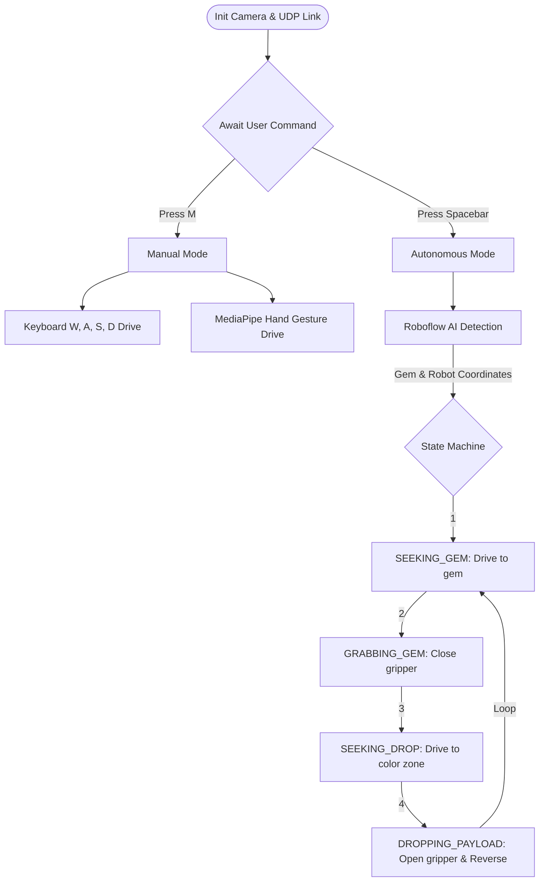

# ExpoRedCrObot (Field-Ready Edition 🏆)

This project contains the complete, field-ready Python overhead camera tracking system and ESP32 firmware for a six-color autonomous gem-sorting robot.

Main executable: **`Field_Ready_Project/Final1.py`**

---

## 🗺️ System Flowchart



---

## ✨ Features (Hybrid AI + CV Architecture)

1. **AI Object Detection (Roboflow):** Cloud AI identification ignoring clutter.
2. **Emergency CV Fallback:** Falls back to local HSV tracking if WiFi drops.
3. **Hand Gesture Control (MediaPipe):** Drive the robot and operate the gripper using hand gestures in Manual Mode.
4. **Robot Exclusion Zone:** 130px dynamic barrier to prevent self-detection loops.
5. **Smart Twin Resolver:** Auto-handles Cyan/Blue lighting overlap.
6. **Mobile IP Webcam Support:** Use Android cameras via HTTP URLs.

---

## 🚀 How to Run

```bash
cd Field_Ready_Project
python3 Final1.py
```

### Setup Steps
1. **STEP 1:** Click 4 corners for homography.
2. **STEP 2:** Click 6 colored drop zones.
3. **READY:** Press `Spacebar` to start Auto Mode, or `M` to drive via Gestures/Keyboard!

---

## ⌨️ Hotkeys
- `Spacebar` : Start / Stop Auto Mode
- `[` / `]` : Adjust Brightness
- `Q` : Quit Program
- `R` : Reset Corners
- `M` : Toggle Manual Mode (Enables Gesture & Keyboard control)
