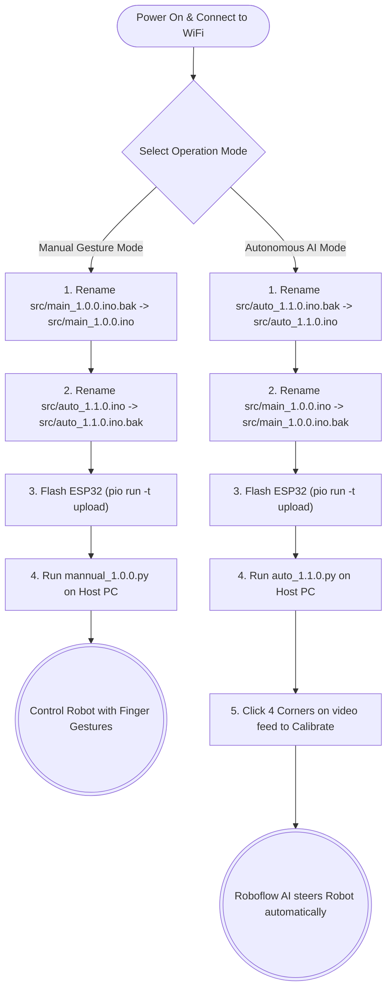

# Dual-Camera Autonomous & Manual Pick-and-Place Robot

A dual-mode robotic vehicle developed for the Mineral Yard engineering demonstration. This system features a hybrid architecture allowing for both **manual gesture control** and **full AI automation** using overhead ArUco tracking and Roboflow Cloud Inference.

All communications are streamed via zero-lag UDP to an ESP32 microcontroller controlling a dual H-bridge motor driver and twin servo grippers.

---

## 🗺️ System Flowchart (How to Use)

Follow this flowchart to quickly select and deploy either the Manual or Autonomous modes.



---

## 📁 File Structure & Purpose

Understanding the repository layout is critical. Because PlatformIO compiles all `.ino` files found in the `src/` folder simultaneously, **you must ensure only one `.ino` file is active at a time**. The unused firmware must be renamed to end in `.bak`.

### Root Directory (`/`)

- **`auto_1.1.0.py`**: The **Autonomous Brain**. This Python script runs on your PC. It reads the overhead webcam, prompts you to click 4 corners for perspective flattening (Homography), runs a threaded Roboflow API call to detect Gems, tracks the robot via ArUco marker ID 30, and streams autonomous steering math to the ESP32 via UDP.
- **`mannual_1.0.0.py`**: The **Manual Brain**. Uses Google MediaPipe to track your hands via your webcam. Translates finger counting (Fists = Stop, 5 fingers = Forward, 3 = Reverse) into UDP steering commands.
- **`auto_1.0.0.py`**: A deprecated/legacy version of the auto mode. Keep for reference.
- **`capture_dataset.py`**: A rapid dataset collection tool. Use this to quickly snap hundreds of diverse images of your arena using an Auto-Burst mode to train custom YOLO or Roboflow models.
- **`platformio.ini`**: The configuration file for the C++ compiler. It defines the ESP32 board, the required libraries (`TFT_eSPI`), and compiler flags (like suppressing touch-screen warnings).

### Source Directory (`src/`)

- **`auto_1.1.0.ino`**: The **Autonomous Rover Firmware**. Acts as a high-speed "Dumb Terminal". It listens for UDP steering packets from the Python script and applies Kinematic LERP (Linear Interpolation) to smoothly accelerate the DC motors without slipping. Controls the servos directly via `ledc` methods.
- **`main_1.0.0.ino.bak`**: The **Manual Rover Firmware**. Built specifically to handle the MediaPipe UDP packets from `mannual_1.0.0.py`. Notice the `.bak` extension — remove `.bak` when you want to compile and upload this mode.

### Backups Directory (`backups/`)

- Contains older, archived versions of scripts and firmwares from earlier stages of development. Safe to ignore unless rolling back changes.

---

## 🔌 Hardware Pinout & Specifications

| Component           | ESP32 Pin  | Peripheral / Library | Function              |
| :------------------ | :--------- | :------------------- | :-------------------- |
| **Left Motor**      | `26`, `27` | `InEngMotor`         | Forward / Reverse     |
| **Right Motor**     | `17`, `16` | `InEngMotor`         | Forward / Reverse     |
| **Left Arm Servo**  | `19`       | Native `ledc` (Ch 4) | Left Gripper Linkage  |
| **Right Arm Servo** | `32`       | Native `ledc` (Ch 5) | Right Gripper Linkage |
| **Display**         | SPI Bus    | `TFT_eSPI`           | Telemetry HUD         |

> **Crucial Note:** We utilize native ESP32 `ledcSetup` and `ledcAttachPin` on hardware channels 4 and 5. The official `ESP32Servo` library is completely removed to prevent hardware timer conflicts with the `InEngMotor` library (which locks channels 0-3).

---

## 💻 Software Setup

### Prerequisites

- Python 3.10 to 3.14
- PlatformIO (VS Code Extension)

### 1. Host Machine (PC) Setup

1. Activate your Python virtual environment:
   ```bash
   source .venv/bin/activate
   ```
2. Install the required computer vision and AI libraries:
   ```bash
   pip install opencv-python numpy mediapipe inference-sdk
   ```
   _(Note: If you are on Python 3.14, use `pip install inference-sdk --ignore-requires-python`)_
3. **Important:** Update the `ESP32_IP` string inside your Python script (`auto_1.1.0.py` or `mannual_1.0.0.py`) to match the IP address displayed on your robot's TFT screen.

### 2. ESP32 Firmware Setup

1. Open this folder in VS Code with PlatformIO installed.
2. Ensure only the firmware you want to use ends in `.ino`. Rename the other to `.ino.bak`.
3. Open the active `.ino` file and update your Wi-Fi credentials:
   ```cpp
   const char* ssid = "YOUR_WIFI_SSID";
   const char* password = "YOUR_WIFI_PASSWORD";
   ```
4. Click the **PlatformIO: Upload** arrow in the bottom taskbar to compile and flash your ESP32.

---

## ⚡ Key Technical Implementations

- **Zero-Lag UDP Transmission:** Commands and Telemetry are broadcast over UDP, dropping round-trip latency below $2\text{ ms}$.
- **Threaded Cloud Inference:** Roboflow API calls take ~200ms. By offloading this to a Python background thread (`roboflow_thread`), the primary OpenCV ArUco tracking loop remains perfectly smooth at 30+ FPS.
- **PWM Kinematic Interpolation (LERP):** The ESP32 applies continuous, non-blocking velocity interpolation ($\Delta v = 5\%$ per $10\text{ ms}$) to prevent gear shearing and wheel slip during sudden velocity changes.
