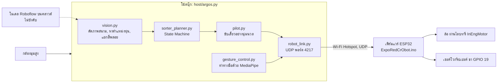
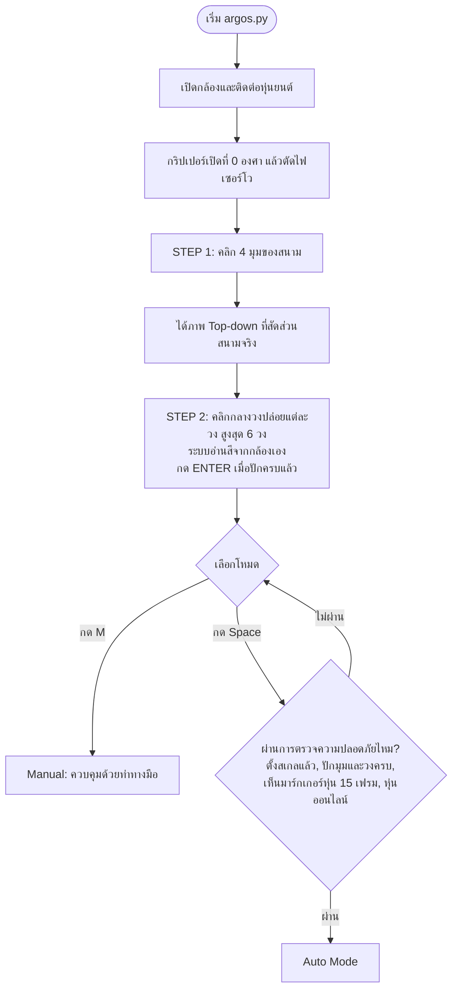
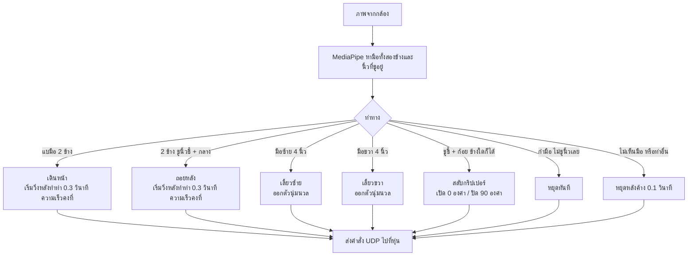
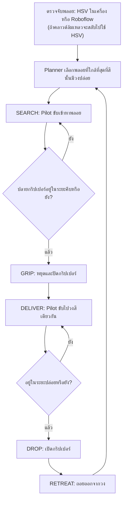
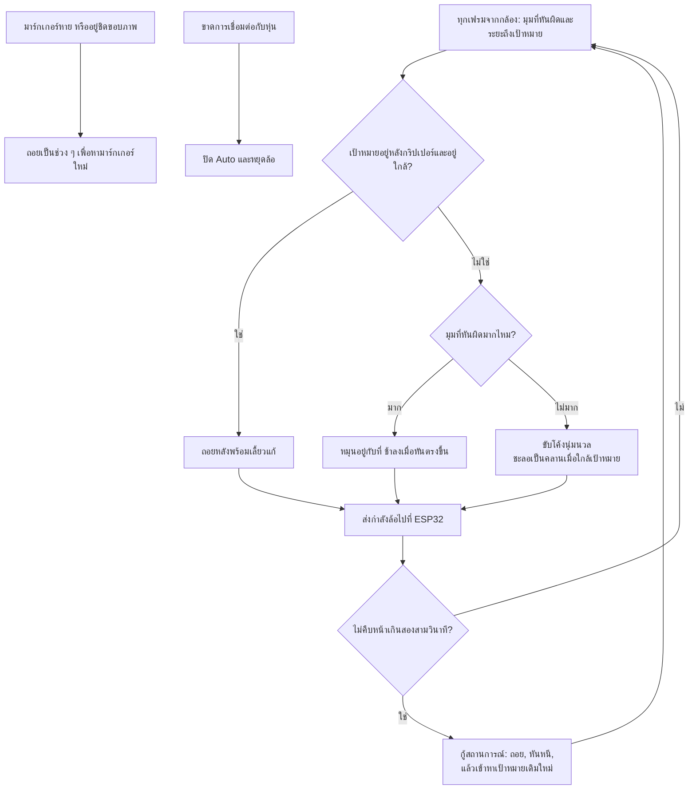
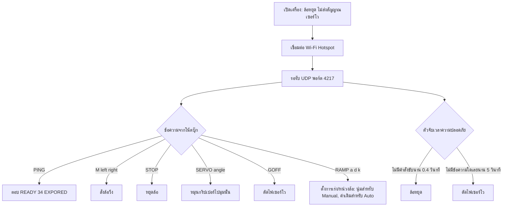
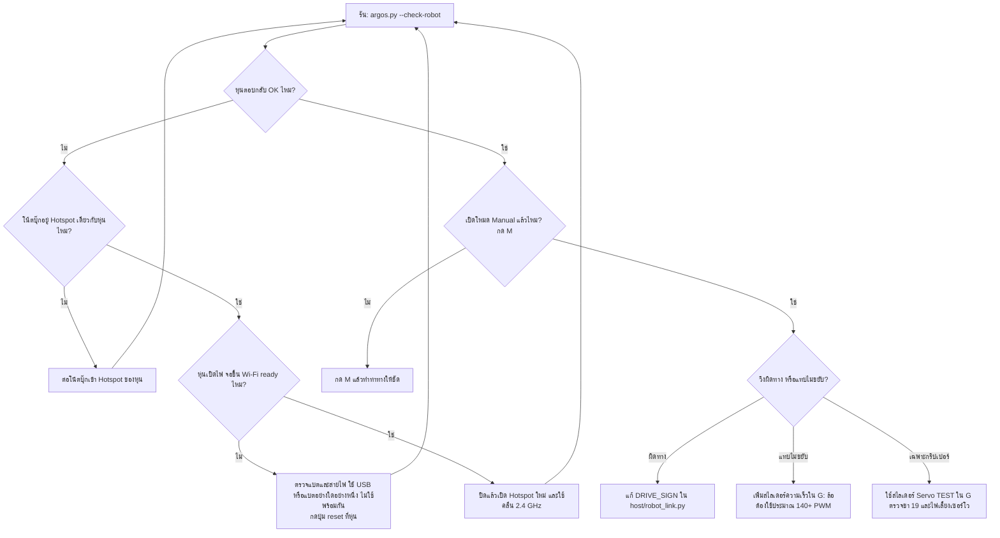

# ARGOS (Autonomous Robotic Gemstone Overhead Sorter) 🏆

ระบบกล้องมุมสูง (Python รันบนโน้ตบุ๊ก) และเฟิร์มแวร์ ESP32 สำหรับหุ่นยนต์คัดแยกพลอยตามสี ออกแบบให้ **พร้อมแข่ง (Field-Ready)** และทนต่อสภาพหน้างานจริง (แสงเปลี่ยน, เงาบัง, Wi-Fi หลุด)

ไฟล์หลักที่ใช้รันโปรแกรม: **`host/argos.py`** คัดพลอยลงวงกลมปล่อย (Drop Zone) ที่คุณคลิกกำหนด (**สูงสุด 6 วง** สีของแต่ละวงที่คลิกคือสีของพลอยที่จะถูกนำไปวางที่นั่น)

---

## 🗺️ แผนผังการทำงาน (System Flowcharts)

### 1. ส่วนประกอบและการเชื่อมต่อ



### 2. ขั้นตอนเริ่มต้นและการตั้งค่า



### 3. โหมด Manual (ท่าทางมือ)



### 4. โหมด Auto: วงจรการคัดแยกหนึ่งรอบ



### 5. โหมด Auto: Pilot เลี้ยวและแก้ปัญหาอย่างไร



### 6. หุ่นยนต์ (ESP32) ทำอะไรกับแต่ละข้อความ



### 7. แก้ปัญหา: หุ่นไม่ขยับ



---

## 📁 โครงสร้างโปรเจกต์

```
platformio.ini          ตั้งค่าบิลด์ ESP32 (ชี้ไปที่ firmware/src)
firmware/src/           เฟิร์มแวร์ ESP32: ExpoRedCrObot.ino (ขับมอเตอร์ผ่าน lib/InEngMotor)
  secrets.example.h     คัดลอกเป็น secrets.h แล้วใส่ชื่อ/รหัสผ่าน Wi-Fi
host/                   โค้ด Python ที่รันบนโน้ตบุ๊ก
  argos.py              โปรแกรมหลัก: กล้อง, การคลิกตั้งค่า, โหมด Manual + Auto
  robot_settings.json   ขนาดหุ่น, ความยาว/ขนาดกริปเปอร์, สเกล, ความเร็ว (แก้เองหรือกด G)
  setup_panel.py        หน้าต่างสไลเดอร์ปุ่ม G
  vision.py             ดัดภาพสนาม, หาตำแหน่งหุ่น, แยกสีพลอย HSV + Roboflow
  sorter_planner.py     State Machine ของ Auto: search → grip → deliver → drop
  pilot.py              ขับเลี้ยวต่อเนื่องนุ่มนวล (หมุน / โค้ง / ถอย, ชะลอเมื่อใกล้เป้าหมาย)
  robot_link.py         ลิงก์ UDP ไปยัง ESP32 (พอร์ต 4217)
  gesture_control.py    ท่าทางมือ MediaPipe สำหรับโหมด Manual
  camera_stream.py, navigation_math.py, safety.py
  assets/               รูปมาร์กเกอร์หุ่น + โมเดลมือ MediaPipe
tools/
  check_colors.py       ทดสอบการแยกสีพลอยจากรูปที่บันทึกไว้ (ไม่ต้องใช้หุ่น)
  sim_pilot.py, sim_cycle.py   จำลองการขับ Auto และวงจรการคัดแยกแบบออฟไลน์
  smoke_auto.py, smoke_manual.py   รันลูปโปรแกรมจริงบนรูปภาพกับหุ่นปลอม (ขับ Auto / ท่าทางและคีย์บอร์ดโหมด Manual)
  test_roboflow.py      ทดสอบโมเดล Roboflow กับรูปใน dataset
data/
  dataset/raw_images/   รูปสนามที่ใช้เทรนโมเดล Roboflow
  captures/             ภาพที่เซฟอัตโนมัติระหว่างรัน Auto (ไม่อยู่ใน git)
```

---

## 🚀 วิธีการใช้งาน (How to Run)

```bash
.venv/bin/python -m pip install -r host/requirements.txt
.venv/bin/python host/argos.py
```

ตัวเลือกที่ใช้บ่อย:

| ตัวเลือก | ความหมาย |
|---|---|
| `--sites 6` | จำนวนวงปล่อยสูงสุดที่ปักได้ 1-6 (ค่าเริ่มต้น 6) กด `ENTER` ตอน Setup เพื่อจบด้วยจำนวนที่น้อยกว่า |
| `--no-gripper` | ทดสอบการขับโดยไม่ใช้เซอร์โว: ไม่ส่งคำสั่งเซอร์โว และแวะพลอยแต่ละเม็ดครั้งเดียว |
| `--colors crimson,violet` | หาเฉพาะสีพลอยที่ระบุ (ค่าเริ่มต้น: ทั้ง 6 สี) |
| `--gripper-distance-px 110` | ตำแหน่งกลางกริปเปอร์ที่อยู่หน้ามาร์กเกอร์ |
| `--detector roboflow` | ใช้โมเดล Roboflow บนคลาวด์ (ต้องตั้ง `ROBOFLOW_API_KEY`) แทน HSV ในเครื่อง |
| `--robot-ip 10.99.204.31` | IP ของหุ่น ถ้า Hotspot บล็อกการค้นหาแบบ Broadcast |
| `--scan-cameras` / `--check-robot` | ตรวจกล้องหรือลิงก์หุ่นโดยไม่ขยับหุ่น |

### ขั้นตอนการ Setup ก่อนเริ่ม
1. **STEP 1:** คลิกเลือกมุมสนามทั้ง 4 มุม เพื่อดัดภาพ Top-down
2. **STEP 2:** คลิกกลางวงปล่อยแต่ละวง (สูงสุด 6 วง สีละหนึ่งวง) ระบบอ่านสีจากกล้องเอง ถ้ามีน้อยกว่า 6 วง ให้กด `ENTER` เมื่อปักครบแล้ว ระบบจะจำค่านี้ไว้
3. **READY:** กด `Spacebar` เพื่อเริ่ม Auto หรือกด `M` เพื่อควบคุมด้วยท่าทางมือ

### ท่าทางมือในโหมด Manual

กด **`M`** และให้กล้องมองเห็นมือของคุณ

| ท่าทาง | หุ่นทำอะไร |
|---|---|
| แบมือ 2 ข้าง (5 + 5) | เดินหน้า (เริ่มวิ่งหลังทำท่า 0.3 วินาที) |
| 2 ข้าง ชูนิ้วชี้ + กลาง พับนางกับก้อย (นิ้วโป้งชูหรือไม่ก็ได้) | ถอยหลัง (เริ่มวิ่งหลังทำท่า 0.3 วินาที) |
| มือซ้าย 4 นิ้ว (ไม่รวมนิ้วโป้ง) | เลี้ยวซ้าย (ออกตัวนุ่มนวล) |
| มือขวา 4 นิ้ว (ไม่รวมนิ้วโป้ง) | เลี้ยวขวา (ออกตัวนุ่มนวล) |
| ชูนิ้วชี้ + ก้อย ข้างใดก็ได้ | สลับกริปเปอร์ เปิด (0°) / ปิด (90°) |
| กำมือ ไม่ชูนิ้วเลย | หยุดทันที |
| ไม่เห็นมือ | หยุดหลัง 0.1 วินาที |

หลังท่าหนึ่งจบ ท่าถัดไปจะถูกมองข้ามเป็นเวลา 0.3 วินาที ความเร็ว, ดีเลย์ และการเร่งตอนเลี้ยว ปรับได้เป็นสไลเดอร์ในหน้าต่าง **`G`** (*Manual speed*, *Backward speed*, *Manual turn speed*, *Fwd/back delay*, *Turn accel*)

**ดูว่ากล้องเห็นอะไร:** แถบสีเหลืองด้านล่างของหน้าต่างบอกจำนวนมือที่เจอ ขนาดมือ นิ้วที่ชูของแต่ละมือ (T I M R P = โป้ง ชี้ กลาง นาง ก้อย) และคำสั่งที่เลือก เช่น `L:I R:I -> B` ใช้ตรวจว่าท่าทางถูกอ่านถูกไหม

**มือเล็กจะถูกมองข้าม:** มือที่เล็กกว่า *Min hand size* (ค่าเริ่มต้น 12% ของความสูงภาพ) จะไม่นับ คนหรือมือที่อยู่ไกลด้านหลังจึงสั่งหุ่นไม่ได้ ถ้ามือของคุณเองถูกมองข้าม ให้ยื่นมือเข้าใกล้กล้อง หรือลดค่าสไลเดอร์

**คีย์บอร์ดสำรองตอนอยู่โหมด Manual:** `W` เดินหน้า, `S` ถอย, `A` เลี้ยวซ้าย, `D` เลี้ยวขวา (กดค้างไว้), `X` หยุด, `O` เปิดกริปเปอร์, `C` ปิดกริปเปอร์ ท่าทางมือมีความสำคัญกว่า และการกำมือยังหยุดหุ่นทันที

### หน้าต่างตั้งค่าหุ่น (กริปเปอร์ + ขนาดหุ่น)

หลังตั้งมุมสนามแล้ว กด **`G`** จะมีหน้าต่างสไลเดอร์เปิดขึ้น:

| สไลเดอร์ | ความหมาย |
|---|---|
| Gripper length px | ระยะจากมาร์กเกอร์บนหลังคาถึงกลางกริปเปอร์ (กากบาทสีเขียว) |
| Gripper size px | รัศมีวงกลมสีเขียวสำหรับคีบ — พลอยอยู่ในวง = ปิดกริปเปอร์ |
| Robot size px | วงกลมสีส้มรอบตัวหุ่น สีที่อยู่ในวงจะถูกมองข้าม |
| Robot rear px | ตัวหุ่นยื่นไปด้านหลังมาร์กเกอร์เท่าไร |
| Arena width / height mm | ขนาดจริงของสนาม ตั้งทั้งสองค่าแล้วรีสตาร์ท: ภาพ Top-down จะได้สัดส่วนจริง (เลี้ยวแม่นขึ้น) และระบบตั้งสเกลให้เอง |
| Auto min / max / spin power | กำลังล้อของ Auto Pilot (min = ต่ำสุดที่หุ่นยังขยับ) |
| Drop distance mm | ต้องเข้าใกล้วงปล่อยแค่ไหนก่อนเปิดกริปเปอร์ |
| Min hand size | มือที่เล็กที่สุด (% ของความสูงภาพ) ที่นับเป็นท่าทาง มือที่เล็กกว่านี้จะถูกมองข้าม |
| Manual speed / Backward speed / Manual turn speed | PWM ตอนเดินหน้า / ถอย / เลี้ยว ในโหมด Manual |
| Gesture pause | จำนวนวินาทีหลังท่าหนึ่งจบก่อนจะรับท่าถัดไป (ค่าเริ่มต้น 0.3 กำมือยังหยุดทันที) |
| Fwd/back delay | จำนวนวินาทีที่รอหลังทำท่าก่อนเริ่มเดินหน้า/ถอย (0 = ทันที) |
| Turn accel +- PWM / Turn accel sec | ความนุ่มนวลของการออกตัวตอนเลี้ยว |
| Servo OPEN / CLOSE angle | มุมกริปเปอร์ตอนเปิด/ปิด (ค่าเริ่มต้น 0° / 90°) |
| Servo TEST angle | ลากเพื่อขยับกริปเปอร์สดๆ ใช้หามุมที่เหมาะ |

การเปลี่ยนแปลงมีผลทันทีและบันทึกลง `host/robot_settings.json` อัตโนมัติ

### โหมด Auto (ทดสอบโดยไม่ใช้เซอร์โว)

```bash
.venv/bin/python host/argos.py --no-gripper
```

1. คลิก 4 มุมสนาม แล้วคลิกวงปล่อยแต่ละวง (สูงสุด 6) กด `ENTER` ถ้ามีน้อยกว่า 6 วง
2. กด **`G`** ตั้ง **Arena width / height mm** (แล้วรีสตาร์ท) — Auto จะถูกบล็อกจนกว่าจะตั้งสเกล
3. วางหุ่น รอให้เห็นลูกศรสีเขียวบนมาร์กเกอร์ แล้วกด **`Space`**

หุ่นจะบังคับต่อเนื่อง (ไม่กระตุกเป็นช่วง ๆ): หมุนหันหาพลอย ขับโค้งนุ่มนวล ชะลอเป็นคลานแล้วหยุดบนพลอย จากนั้นไปวงที่มีสีเดียวกับพลอย

### Pseudocode ของโหมด Auto: หุ่นสร้างเส้นทางเป็นเส้นแล้ววิ่งตามเส้นนั้น

```text
ทุกเฟรมจากกล้อง ขณะที่ Auto เปิดอยู่:
    view  = ดัดภาพกล้องให้เป็นแผนที่สนามมุมสูง (Top-down)
    pose  = หามาร์กเกอร์ของหุ่น  (x, y, ทิศที่หัน)
    gems  = ตรวจจับพลอย (HSV ในเครื่อง หรือ Roboflow)
    gems  = เก็บเฉพาะพลอยที่สีนั้นมีวงปล่อย

    เลือกเป้าหมายตามเฟสปัจจุบัน:
        SEARCH   -> พลอยที่เลือกไว้ (ใช้เม็ดเดิมจนกว่าจะคีบได้)
        DELIVER  -> วงปล่อยที่สีตรงกับพลอยที่คีบอยู่
        HOME     -> จุดกลางสนามที่บันทึกไว้

    path = เส้นตรง LINE จากกริปเปอร์ไปยังเป้าหมาย  # สร้างใหม่ทุกเฟรม
                                                  # วาดเป็นเส้นสีเหลืองบนหน้าจอ
    error    = มุมระหว่างทิศที่หุ่นหันกับทิศของเส้นทาง
    distance = ระยะจากปลายกริปเปอร์ถึงเป้าหมาย

    ถ้า distance <= ระยะหยุด:
        ไปเฟสถัดไป:  SEARCH -> GRIP (ปิด) -> DELIVER -> DROP (เปิด) -> RETREAT -> SEARCH
    ถ้าไม่:
        วิ่งไปตามเส้นทาง:
            เป้าหมายอยู่หลังกริปเปอร์และอยู่ใกล้  -> ถอยหลัง
            error มาก                              -> หมุนอยู่กับที่จนหันหน้าตรงเส้นทาง
            นอกนั้น                                -> ขับตามเส้นทางเป็นโค้งนุ่มนวล
                                                       เลี้ยวให้ error เป็น 0
                                                       ชะลอเป็นคลานเมื่อใกล้เป้าหมาย

    ถ้าไม่คืบหน้ามาสองสามวินาที:
        ถอยหลัง หันหนี แล้วสร้างเส้นทางใหม่จากตำแหน่งใหม่
```

เส้นทางคือเส้นตรงที่สร้างใหม่จากตำแหน่งปัจจุบันของหุ่นทุกเฟรม (เห็นเป็นเส้นสีเหลืองบนหน้าจอ) ถ้าหุ่นถูกดันหลุดเส้น หรือพลอยขยับ เส้นทางถัดไปจะเริ่มจากจุดที่หุ่นอยู่ตอนนี้ ระบบยังไม่วางเส้นทางอ้อมสิ่งกีดขวาง

### ทดสอบการแยกสีโดยไม่ใช้หุ่น

```bash
.venv/bin/python tools/check_colors.py data/captures/raw/*.jpg
```

ภาพที่วาดผลลัพธ์แล้วจะอยู่ใน `data/color_check/`

### เฟิร์มแวร์

คัดลอก `firmware/src/secrets.example.h` เป็น `firmware/src/secrets.h` ใส่ข้อมูล Wi-Fi แล้วบิลด์และอัปโหลดด้วย PlatformIO จากโฟลเดอร์หลัก (พอร์ตอัปโหลดถูกล็อกเป็น `/dev/cu.usbserial-1120` ใน `platformio.ini`):

```bash
pio run -t upload
```

ต้องอัปโหลดใหม่เฉพาะเมื่อแก้ไฟล์ `firmware/src/ExpoRedCrObot.ino` เท่านั้น การปรับความเร็ว ดีเลย์ หรือมุมกริปเปอร์ เป็นค่าฝั่งโน้ตบุ๊กอย่างเดียว

หุ่นรับข้อความ UDP เหล่านี้ที่พอร์ต 4217:

| ข้อความ | ความหมาย |
|---|---|
| `PING` | ตอบ `READY 34 EXPORED` |
| `M left right` | สั่งล้อวิ่ง (-255 ถึง 255 ต่อข้าง) |
| `STOP` | หยุดล้อ |
| `SERVO angle` | หมุนเซอร์โวกริปเปอร์ (0-180°) |
| `GOFF` | ตัดไฟเซอร์โวกริปเปอร์ |
| `RAMP accel decel kick` | ตั้งการเร่ง/หน่วงล้อ (นุ่มสำหรับ Manual, ค่าเดิมสำหรับ Auto) |

---

## ⌨️ คีย์ลัดควบคุม (Hotkeys)

- `Spacebar` : เริ่ม / หยุด โหมด Auto
- `Enter` : ตอน Setup จบด้วยวงปล่อยที่ปักไว้แล้ว (น้อยกว่า 6 วง)
- `[` และ `]` : ลด / เพิ่ม ความสว่างของกล้อง (ล้างจุดวงปล่อย)
- `Z` : ปักวงปล่อยใหม่ · `R` : รีเซ็ตมุมสนามและวงปล่อย
- `H` : บันทึกตำแหน่งกลางสนาม · `B` : กลับไปกลางสนามแล้วเริ่มใหม่
- `G` : หน้าต่างตั้งค่าหุ่น
- `M` : สลับโหมดบังคับ (Manual) ด้วยท่าทางมือ
- `Q` : ปิดโปรแกรม
